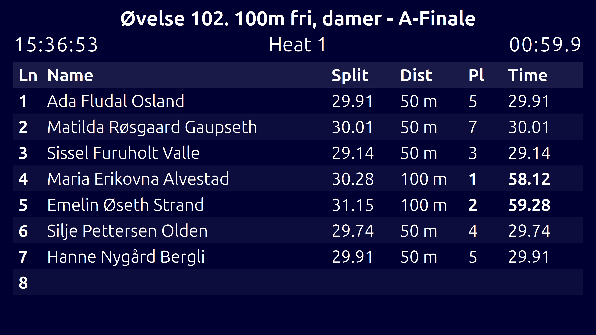

# Swimming Scoreboard

This is a simple FastAPI-based web server that presents a swimming scoreboard
and a control panel.

The scoreboard can be used with the Swiss Timing Quantum timing system. The
scoreboard reads the OSM6 protocol (serial data over RS-422), which is also
used to transfer live data from the timing system to a meet manager.

> [!WARNING]
> If you plan to use this software, please carefully test it well in advance.
> There are an almost infinite amount of ways things can go wrong. Your system
> configuration can be different from what was used during the development of
> this software and you might get undesired behavior. Testing in advance on
> your own hardware in your own swimming pool is the only way to figure
> out if this is something for you.

## Features

- Scoreboard page showing race name, heat, and a table with lane, rank, name,
  distance (m), split (last lap), and total time.
- Control panel for updating basic communication and pool settings.
- Live updates pushed to all connected scoreboard clients over WebSockets.
- The scoreboard client page has a clock synchronization mechanism to allow
  accurate display of the heat timer even if the client runs on a separate
  computer with a clock that is not in sync with the main server clock.

## Example




## Input files

To gather heat information, the scoreboard software reads the LST/DH files
that are used as *input* to the Quantum system. To gather information about
events, heats, and lanes, the following files are read:

 * `lstconc.txt`: Information about swimmer names and club or nation
 * `lststart.txt`: Information about events, heats, and lane association

Event names can be gathered from multiple locations. The main location
is a file `meetsetup.xml`, a format written by the Norwegian meet manager
*Victoria*. From this file the event titles, as defined in the meet manager,
are read. If a sponsor is defined for an event, that is also considered.

If the `meetsetup.xml` is not available, the files:

 * `lstrace.txt`: Event information (gender, length, etc.)
 * `lstround.txt`: Round information (timed finals, finals, etc.)
 * `lstlong.txt`: Distances (e.g. `50 m`, `100 m`)

are read and generic titles such as *Event 5: 100 m Freestyle, Final, M*
are constructed.

From these sources, the file `events.json` is written out. Whenever this file
is present, it is always preferred over any of the above, which is only used
for the initial setup. If any information from the above mentioned files are
incorrect or needs to be edited, you can safely edit this file to override the
displayed information. This allows you to set whatever event title and subtext
you want.

## Installation

If you only intend to use the scoreboard on Windows, the easiest method is
to download the latest distribution, unpack the ZIP file in a folder of your
choice and run the software from there.

For setting up a development environment, the procedure is as follows:

```bash
python -m venv .venv
source .venv/bin/activate  # On Windows: .venv\\Scripts\\Activate.ps1
pip install -r requirements.txt
```

## Running the server

On Windows, just run the supplied binary. Afterwards, you can visit the
control panel or scoreboard page from a browser:

- Scoreboard: http://localhost:8000/scoreboard
- Control panel: http://localhost:8000/control

The first thing you need to do is give the server the path to your input
files, serial port, and settings. After that, the scoreboard should be fully
operational.

Once the server is up and running, the relevant input files are monitored for
changes. If changes to the input files are detected, they are automatically
reloaded at the start of a new heat. In this way, if you add swimmers to
heats while the software is running, it will always use the latest available
database files.

On Linux, the user running the server needs permissions to open `/dev/ttyUSB0`
(or whatever serial port is used). This is typically done by adding the user
to the `dialout` group:

```bash
sudo usermod -a -G dialout $USER
```

Then start the server:

```bash
uvicorn scoreboard.server:app --reload
```

## Safety and intended deployment

- This application has **no authentication** by design.
- It is intended to run with the server and the operator UI (Control panel) on
  the **same computer**, or within a completely controlled and
  trusted local network.
- If the machine is connected to a broader network, use a firewall and/or bind
  the server to localhost only.

## Configuration and persistence

The application stores its configuration in a JSON file:

- Linux: `~/.config/swimming-scoreboard/config.json`
  (or `$XDG_CONFIG_HOME/swimming-scoreboard/config.json`)
- Windows: `%APPDATA%\swimming-scoreboard\config.json`

The configuration includes:

- `timing_config`
  - `lst_path`: path to Meet Manager / timing LST files
  - `com_port`: serial port (e.g. `COM3` on Windows, `/dev/ttyUSB0` on Linux)
  - `com_settings`: serial settings string (default `9600,7,n,1`)
  - `debug_path`: optional file path to capture raw serial frames as
    newline-delimited JSON
  - `hold_results_time`: seconds to keep results visible after finish before
    resetting
- `pool_config`
  - `lane_count`: number of lanes displayed
  - `first_lane`: first lane number (lane numbering offset)
  - `lap_meters`: distance (meters) per lap as used for the `dist` column
    (`laps * lap_meters`)
- `scoreboard_settings`
  - background/font colors and font scale

All of these can be changed from the Control panel. Changes are persisted
automatically, you do not need to reconfigure the software in case of a
restart.

## Wiring (TX/RX cross)

For Swiss Timing Quantum (RS-422 connector), wire as follows:

- Quantum pin **3**  → USB-to-RS422 converter pin **4**
- Quantum pin **4**  → USB-to-RS422 converter pin **3**

This should work for most common USB-to-RS422 converters. Please check the
documentation for your special device if in doubt. If you already have cables
and/or adapters that you use with your meet manager, they should work fine
with this software as well.

## Alternative setup: share a serial port

If your meet management software is already connected to the Quantum on the
same PC as you intend to run the scoreboard on, you can use special software
to share a single physical serial port so both applications can read the
timing messages. There are multiple such programs for Windows; most require
a paid license.

## Control panel settings

In the Control panel → **Timing configuration**:

- **LST path**: point this to the Meet Manager export path (used to resolve
  event titles, lane assignments, and event text).
- **COM port**: choose the physical COM port (or a virtual COM port if using a
  splitter).
- **COM settings**: default is `9600,7,n,1`.

### Important: timing settings restart the listener

Each time you change and save the timing system settings, the communication
listener process is restarted.

- The restarted listener loses its in-memory state about the **current event /
  heat**.
- If you change timing settings in the middle of a heat, the scoreboard will
  stop updating for the rest of that heat and will typically not recover until
  a **new heat** is started/opened.

### Pool configuration

In the Control panel → **Pool**:

- **Lane count** / **First lane**: controls how many lanes are shown and their
  numbering.
- **Lap meters**: the per-lap distance used to compute the `dist` column. This
  is usually the distance between two touchpads. If you have a 25 meter pool
  with touchpads at one end, the lap distance is 50 meters.


## License

Swimming Scoreboard
Copyright (C) 2026 Håkon Strandenes, haakon@hakostra.net

This program is free software: you can redistribute it and/or modify
it under the terms of the GNU General Public License as published by
the Free Software Foundation, either version 3 of the License, or
(at your option) any later version.

This program is distributed in the hope that it will be useful,
but WITHOUT ANY WARRANTY; without even the implied warranty of
MERCHANTABILITY or FITNESS FOR A PARTICULAR PURPOSE.  See the
GNU General Public License for more details.

You should have received a copy of the GNU General Public License
along with this program.  If not, see <https://www.gnu.org/licenses/>.
